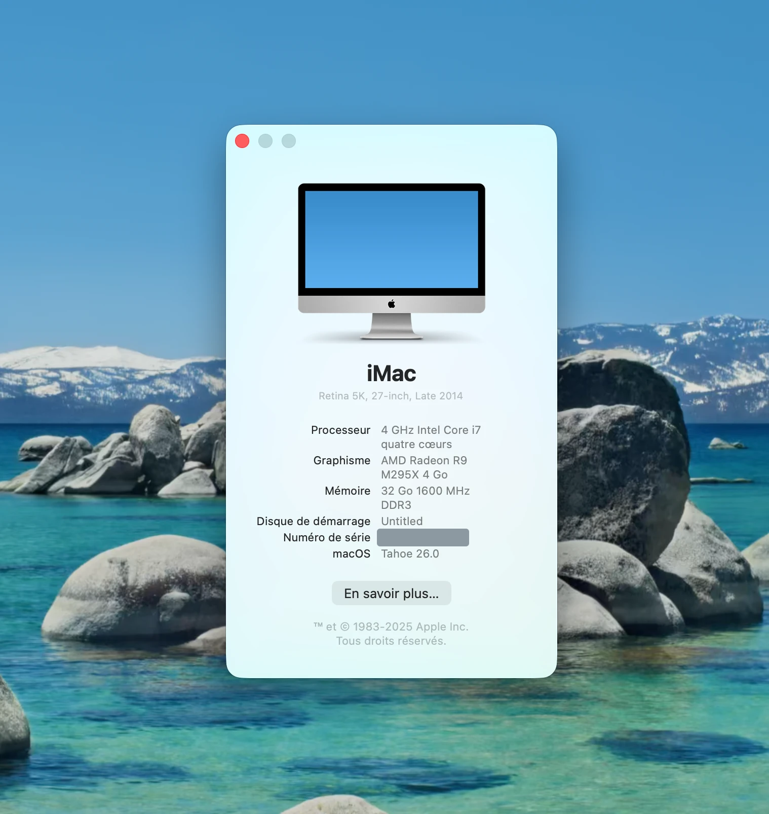

# macOS 26 Tahoe on a Legacy GCN iMac (iMac15,1)

Fixes, tools and measurements for running **macOS 26.0 (25A354)** on a **late‑2014 5K iMac
(iMac15,1)** through an OpenCore Legacy Patcher 2.5 EFI. It covers Metal acceleration on the
AMD Radeon R9 M295X (Legacy GCN), Wi‑Fi, audio, Bluetooth and USB.

This is one machine, tested by one person. Every claim below was measured on that machine, and
the raw evidence is in the repository. Anything **not** verified is marked as such. It is not a
supported product, and it is not part of OCLP.

<p align="center">
  
  <br>
  <sub>The machine, booted on macOS Tahoe 26.0 (French UI). Serial number masked.</sub>
</p>

## Status

| Component | Status on macOS 26.0 | What it takes | Details |
|---|---|---|---|
| **GPU / Metal** (R9 M295X, Tonga, Legacy GCN) | Desktop, WindowServer and Metal work | OCLP's *AMD Legacy GCN* files + a corrected `impostor.dylib` | [docs/gpu.md](docs/gpu.md) |
| **Wi‑Fi** (Broadcom BCM4360, `14e4:43a0`) | Works, **with VT‑d on**: 802.11ac, 5 GHz, ~147 Mbit/s measured | Legacy Wi‑Fi stack enabled for Darwin 25 + **`BrcmIOVAFix.kext`** + OCLP userspace (PatcherSupportPkg **1.9.6**) | [wifi/README.md](wifi/README.md) |
| **Audio** (Intel HDA) | Internal speakers and microphone work | `AppleHDA.kext` (removed in macOS 26) put back from macOS 15 + kernel collections rebuilt | [audio/README.md](audio/README.md) |
| **Bluetooth** (BCM20702) | Works natively | nothing | — |
| **USB** | Works (keyboard, mouse, FaceTime camera, Bluetooth hub) | `USB-Map-Tahoe.kext`: OCLP's map + `usb-port-number` | [usb/](usb/) |
| **Ethernet** (BCM5701) | Works natively | nothing; keep VT‑d **on** | — |
| AirDrop / Continuity | AWDL comes up (AirDrop channel 44) | — | not tested end to end |
| Sleep / wake | — | — | **not tested** |

## The machine

| | |
|---|---|
| Model | iMac15,1, Core i7‑4790K (Haswell) |
| GPU | AMD Radeon R9 M295X (Tonga, `1002:6938`), Legacy GCN v3 |
| Wi‑Fi / Bluetooth | Broadcom BCM4360 (`14e4:43a0`) / BCM20702 (USB) |
| macOS | 26.0 (25A354) |
| Bootloader | OpenCore 1.0.6, EFI built by OCLP 2.5.0 for iMac15,1 |
| Kexts in the EFI | Lilu 1.7.1, AirportBrcmFixup 2.1.9, RestrictEvents 1.1.7, AMFIPass 1.4.1, OCLP's Wi‑Fi stack (IOSkywalkFamily 1.2.0, IO80211FamilyLegacy, AirPortBrcmNIC), USB maps, and the two kexts from this repo |
| Rescue | a second disk with macOS 15 Sequoia and its own OpenCore |

### OpenCore settings that matter

| Setting | Value | Why |
|---|---|---|
| `csr-active-config` | `03080000` | OCLP default for root patching |
| `SecureBootModel` | `Disabled` | OCLP default for root‑patched systems |
| boot‑args | `keepsyms=1 debug=0x100 -lilubetaall ipc_control_port_options=0 -nokcmismatchpanic amfi_get_out_of_my_way=1` | `-lilubetaall` loads Lilu plugins on macOS 26; `amfi_get_out_of_my_way=1` lets ad‑hoc signed code load in WindowServer (GPU shim) and in the Wi‑Fi daemons |
| `Kernel/Quirks/DisableIoMapper` | **`false`** | Turning VT‑d off broke WindowServer on this machine (it aborted during display setup). The Ethernet and SD drivers also expect VT‑d. The Wi‑Fi fix works *with* VT‑d. |

## Installation

Do it in this order, with **one change per reboot**. Do it only if you can recover: see
**Rescue** below first.

### 0. Before anything: a way back

You need a second macOS (Sequoia here) that boots through its **own** OpenCore on another disk.
That is the only way out when the main EFI or the Tahoe system volume stops booting. Then copy
`rescue/` somewhere that macOS can read (`/Users/Shared/rescue-tahoe/` on it), and after every
successful Tahoe boot run:

```sh
sudo bash rescue/rescue-tahoe.sh sauver      # saves config.plist.last-good + copies the kit to the EFI
```

`rescue-tahoe.sh` finds the volumes by **UUID**. Edit the two UUIDs at its top for your machine:
`diskN` numbers change from one boot to the next. On this iMac, `disk0s1` was the main EFI on one
boot and the rescue EFI on the next.

### 1. EFI (OpenCore)

1. Build the EFI with OCLP 2.5.x for your model, as usual.
2. USB: generate the Tahoe map from OCLP's, then set the bounds in `config.plist`:
   ```sh
   bash usb/make-usb-map-tahoe.sh /Volumes/EFI/EFI/OC/Kexts/USB-Map.kext /Volumes/EFI/EFI/OC/Kexts
   ```
   - `Kernel/Add` → `USB-Map.kext`: `MaxKernel` = `24.99.99`
   - `Kernel/Add` → new entry `USB-Map-Tahoe.kext`: `MinKernel` = `25.0.0`
3. Add `amfi_get_out_of_my_way=1` to the boot‑args.

### 2. GPU acceleration

On macOS 26, OCLP 2.5's own *AMD Legacy GCN* patch set leaves a flat‑coloured screen with a live
cursor. Three defects in its Metal shim (`impostor.dylib`) cause that; [docs/gpu.md](docs/gpu.md)
explains them, with the measurements.

1. **The AMD Legacy GCN files must be on the Tahoe system volume.** These are the AMD controller
   kexts, `AMDRadeonX4000`, `AMDFramebuffer`, `AMDSupport`, the VA/GL/Metal bundles, a merged
   Kernel Debug Kit and a rebuilt kernel collection. **This step is not scripted here.**
   OCLP 2.5.1 refuses to root‑patch macOS 26: `_max_os = sequoia` in
   `sys_patch/patchsets/detect.py`. On this machine it was done outside the official patcher,
   and the exact Bronze bundle installed does not match any variant in PatcherSupportPkg's git
   repository. If you reproduce this, record exactly what you install.
2. Build the corrected shim (needs the Command Line Tools):
   ```sh
   bash build.sh                 # -> build/impostor.dylib (+ test programs)
   ```
3. Install it on the live system volume and take a new snapshot. This is how it was done here:
   ```sh
   sudo mount -o nobrowse -t apfs /dev/diskXsY /System/Volumes/Update/mnt1   # Tahoe system volume, not its snapshot
   sudo install -o root -g wheel -m 755 build/impostor.dylib \
     /System/Volumes/Update/mnt1/System/Library/Extensions/AMDMTLBronzeDriver.bundle/Contents/MacOS/impostor.dylib
   sudo bless --folder /System/Volumes/Update/mnt1/System/Library/CoreServices --bootefi --create-snapshot
   ```

### 3. Wi‑Fi (Broadcom BCM4360 / 4350 / 43602)

1. Get `BrcmIOVAFix.kext`. Use the prebuilt one in `wifi/BrcmIOVAFix/prebuilt/` (SHA‑256 of the
   binary: `b956c092…4864fce`), or build it yourself. The build needs no Xcode, only Command Line
   Tools, from Tahoe or from the Sequoia volume:
   ```sh
   bash wifi/BrcmIOVAFix/build.sh
   ```
2. Enable OCLP's legacy Wi‑Fi stack for Darwin 25 and add the two kexts from this repo. Mount the
   main EFI **by UUID**, then:
   ```sh
   bash wifi/efi-wifi.sh            # check only
   bash wifi/efi-wifi.sh --apply    # keeps config.plist.pre-wifi
   ```
3. Reboot, then check that the kernel part is all `ok` and Wi‑Fi powers on:
   ```sh
   bash wifi/check-wifi.sh
   ```
4. If it boots fine, run `sauver` (step 0). Then install the userspace half and reboot:
   ```sh
   sudo bash wifi/root-patch-wifi.sh
   ```
   It installs `IO80211.framework`, `WiFiPeerToPeer.framework` and `wifip2pd` from
   PatcherSupportPkg **1.9.6** (Darwin 25 build). It checks SHA‑256 **and** `codesign` before
   writing anything, and refuses to continue if the live volume's GPU shim differs from the
   running one.
5. Join a network, then run `bash wifi/check-wifi.sh` again.

### 4. Audio

macOS 26 has no `AppleHDA.kext`, so a non‑T2 Mac has no sound device at all. Install the one from
an installed macOS 15. This needs the Kernel Debug Kit already merged, as the GPU patch does:

```sh
sudo bash audio/root-patch-audio.sh "/Volumes/<macOS 15 volume>/System/Library/Extensions/AppleHDA.kext"
```

It saves the current kernel collections to `/Users/Shared/rescue-tahoe-kc/`, rebuilds them with
`kmutil`, and takes a new snapshot. If anything fails, it restores the previous state. Reboot,
then run `system_profiler SPAudioDataType`.

### 5. Bluetooth

Nothing to do on this machine: the Apple BCM20702 works natively.

## Rescue

[rescue/PROCEDURE.md](rescue/PROCEDURE.md) (in French) is the step‑by‑step. In short, boot
Sequoia through the rescue OpenCore, then:

| What broke | Command |
|---|---|
| An EFI change (kext, quirk, boot‑arg) | `sudo bash /Users/Shared/rescue-tahoe/rescue-tahoe.sh efi`: restores `config.plist.last-good` |
| A root patch (files on the system volume) | `sudo bash /Users/Shared/rescue-tahoe/rescue-tahoe.sh wifi`: removes the Wi‑Fi userspace files and takes a new snapshot |
| The audio patch (AppleHDA + kernel collections) | `sudo bash /Users/Shared/rescue-tahoe/rescue-tahoe.sh audio`: removes AppleHDA, restores the saved kernel collections, new snapshot |

Never use OCLP's *Revert Root Patches* (`bless --last-sealed-snapshot`). It goes back to Apple's
sealed snapshot and removes the GPU work too.

## Findings worth reporting upstream

1. **Tahoe's x86 kernel no longer maps mbufs into the IOMMU.** `config_mbuf_mcache` was dropped
   from `config/MASTER.x86_64` in xnu‑12377. As a result `mbuf_data_to_physical()` returns raw
   physical addresses. The legacy `AirPortBrcmNIC` maps every packet through
   `IOMbufNaturalMemoryCursor`, so with VT‑d on its DMA is rejected: TX hangs and the chip
   enters fatal error. That is why other Tahoe setups need `DisableIoMapper=true`.
   `BrcmIOVAFix` routes `osl_dma_map` and maps each range with `IODMACommand` instead. Details
   and evidence: [wifi/README.md](wifi/README.md).
2. **PatcherSupportPkg 1.9.7's `13.7.2-25` `IO80211` shim has an invalid code signature.** The
   call to `jscSetup()` was replaced by 5 NOPs without re‑signing. Installed, it makes every
   early daemon fault on load (`CODE SIGNING: rejecting invalid page`), and macOS 26 hangs
   halfway through boot. 1.9.6's file is valid.
3. **USB maps need `usb-port-number` on macOS 26.**
4. **OCLP 2.5's GCN Metal shim** has three defects on macOS 26: [docs/gpu.md](docs/gpu.md).

## Known issues and limits

- One machine, one GPU, one macOS build (25A354). Other Legacy GCN cards, other Macs and other
  26.x builds are untested.
- `MTLCompilerService` crashes (null dereference) in bursts after boot, when `photolibraryd`
  compiles Metal shaders. No visible effect on the desktop so far. Not investigated.
- `BrcmIOVAFix` logs through Lilu's `SYSLOG`, but Lilu plugin logs do not reach the unified log on
  this system, including AirportBrcmFixup's. Its activity is inferred from the results: no
  `MQ_ERROR` dumps, working traffic.
- Not tested: sleep/wake, AirDrop and Handoff end to end, hours‑long Wi‑Fi stability.

## Security trade‑offs

This is a test machine. Know what you give up:

- SIP partially disabled (`0x803`) and `SecureBootModel=Disabled`.
- `amfi_get_out_of_my_way=1` turns off AMFI's library validation for **everything**. It is needed
  because the GPU shim is ad‑hoc signed and loads into WindowServer. A shim signed with OCLP's
  certificate chain would only need AMFIPass.
- `BrcmIOVAFix` keeps permanent IOMMU mappings for the pages the Wi‑Fi card used. The card can
  still reach those pages later. Sequoia's kernel did the same for the whole mbuf pool.

## How the claims are backed

- GPU: every test in `tests/` prints a macOS 15.8 reference that passes in full. Raw logs from
  both systems are in `results/`. See [docs/gpu.md](docs/gpu.md) for the factorial table of the
  fixes.
- Wi‑Fi: the root cause comes from the driver's own CoreCapture dumps, PCI config‑space
  snapshots, disassembly (`llvm-objdump`) and Apple's published XNU and IOKit sources for both
  releases. The fix was then confirmed on hardware. Each step is in
  [wifi/README.md](wifi/README.md), including the hypotheses that turned out **wrong** (the
  DriverKit dext, AWDL, ASPM) and how they were ruled out.
- `wifi/check-wifi.sh` prints the state any reader can compare against.

## Repository layout

```
README.md                 this file
docs/gpu.md               the three Metal shim defects, measured
docs/images/              About This Mac screenshot (serial number masked)
src/                      corrected impostor.dylib (shipped copy table + three fixes)
tests/  results/          GPU test programs and raw logs (macOS 26 and 15.8)
build.sh                  builds the shim and the test programs
wifi/README.md            Wi-Fi investigation, root cause, fix
wifi/BrcmIOVAFix/         the Lilu plugin: source, build.sh, prebuilt/
wifi/BCMWLAN-Block.kext   codeless; keeps Apple's AppleBCMWLAN dext off the card (harmless)
wifi/efi-wifi.sh          enables the legacy Wi-Fi stack on Darwin 25 + adds both kexts
wifi/root-patch-wifi.sh   Wi-Fi userspace (PatcherSupportPkg 1.9.6), verified, with --revert
wifi/check-wifi.sh        read-only status (--log for the kext's lines)
usb/make-usb-map-tahoe.sh OCLP USB-Map.kext -> USB-Map-Tahoe.kext
usb/examples/iMac15,1/    the map used on this machine
audio/root-patch-audio.sh AppleHDA from macOS 15 + kmutil rebuild, with --revert
audio/README.md           why, what was checked, rescue
rescue/                   rescue-tahoe.sh (etat / sauver / efi / wifi / audio) + PROCEDURE.md
```

## Credits

[Dortania / OpenCore Legacy Patcher](https://github.com/dortania/OpenCore-Legacy-Patcher) and
PatcherSupportPkg; [acidanthera](https://github.com/acidanthera) for OpenCore, Lilu,
AirportBrcmFixup and MacKernelSDK; the KGP OCLP forks, used for comparison; Apple's published
[XNU sources](https://github.com/apple-oss-distributions/xnu).
